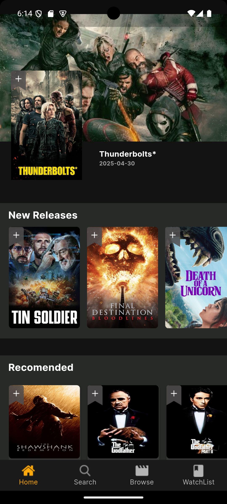
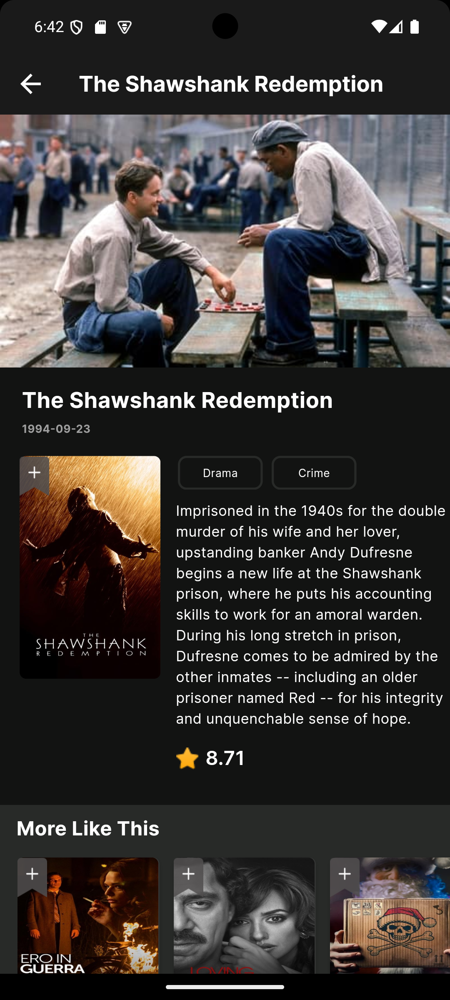
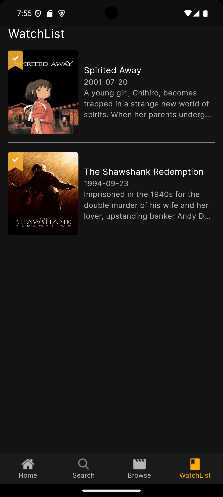

# 🎬 Movies App

**Movie Discovery App** built with Flutter.

Movies App is a beautifully designed mobile application that allows users to discover, explore, and keep track of their favorite movies. Whether you're looking for the latest blockbusters, trending films, or detailed movie information, this app delivers a smooth and intuitive experience.

---

## ✨ Features
- **🔍 Search & Discover:**
  Find trending, upcoming, and top-rated movies using real-time data from the TMDb API.

- **📄 Detailed Movie Pages:**
  View rich movie details including title, synopsis, poster, genres, release date, and user ratings.

- **🎞️ Browse by Categories:**
  Explore movies grouped into different categories and genres such as Action, Comedy, Drama, Horror, and more. Easily filter your discovery experience based on your mood or interests.

- **❤️ Favorites & Watchlist:**
  Save movies you love or plan to watch with Firebase-backed persistent storage.

- **📱 Responsive UI:**
  Clean, adaptive user interface built with flutter_screenutil for a consistent experience across screen sizes.

- **🔥 Firebase Integration:**
  Uses Firebase Firestore to store user preferences and favorite movies.


---

## 🏗 Architecture

- **Clean Architecture** with feature-based modular structure
- **MVVM Pattern** for separation of concerns
- **BLoC** for reactive and maintainable state management

---

## 🚀 Getting Started

### Prerequisites

- Flutter SDK (3.0 or above recommended)
- Firebase project (with `firebase_options.dart` generated)
- Internet connection for API access

### Installation

1. Clone the repository:
   ```bash
   git clone https://github.com/AlaaKhairy0/Movies_App.git
   cd movies_app
   ```

2. Install dependencies:
   ```bash
   flutter pub get
   ```

3. Run the app:
   ```bash
   flutter run
   ```

---

## 🔥 Firebase Setup

This project includes `firebase_options.dart`. To regenerate it or link to your Firebase project, use:

```bash
flutterfire configure
```


---

## 🌐 API Integration

This app uses the [TMDb (The Movie Database) API](https://developers.themoviedb.org/3/getting-started/introduction)  
to fetch movie data including titles, overviews, posters, genres, ratings, and more.


---

## 📱 Screenshots

| Home | Movie Details | WatchList                                       |
|------|----------------|-------------------------------------------------|
|  |  |  |

---

## 📽 Demo Video

Watch the demo video of the app:  
👉 [The Demo](https://drive.google.com/file/d/1J_AofFClqZUP76huOM9M-PQMgoWggoqu/view?usp=sharing)

---

## 🧑‍💻 Contributors

**Alaa Khairy** • [@AlaaKhairy0](https://github.com/AlaaKhairy0)  
**Mohamed Abdallh** • [@MohamedAElkhateeb](https://github.com/MohamedAElkhateeb)


